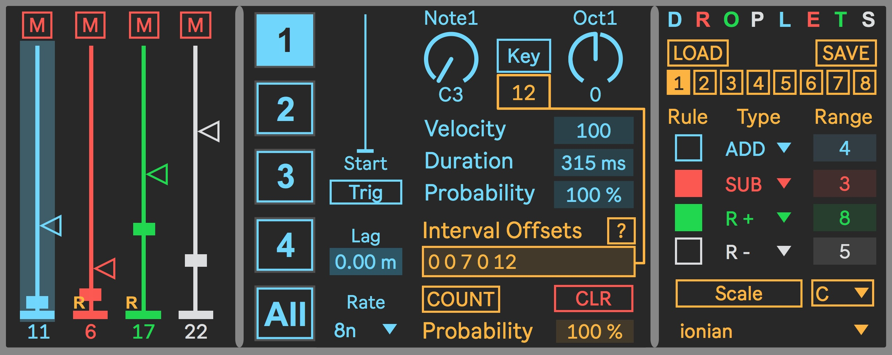
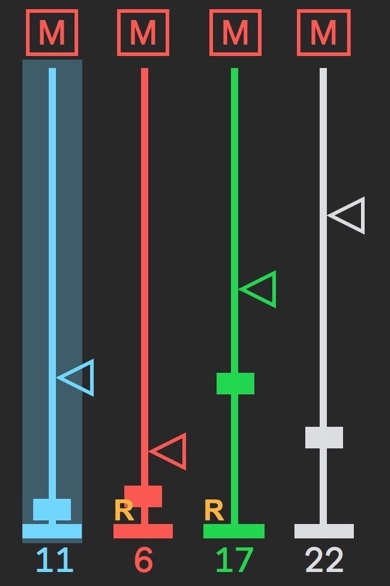
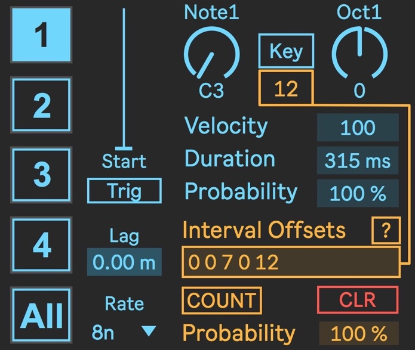
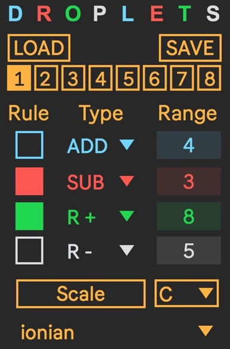
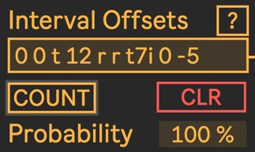

# Droplets

A Max For Live counter based note sequencer inspired by the excellent [Meadowphysics](https://monome.org/docs/meadowphysics/) patch/eurorack module from monome. Droplets is my attempt at repurposing a few of the ideas presented in Meadowphysics for use without a grid, while still trying to maintain an interface that invites experimentation and interaction.

Droplets is made up of four note events, each called a droplet. A droplet is dropped from a certain height, and when it reaches the ground that droplet is triggered. Each droplet is composed of a base pitch, velocity, duration and trigger probability. A droplet drops at its own clock rate (relative to Live's tempo), and features an interval offset list processing section that enables each droplet to create a melody or chord centered on the base pitch. A single instance of Droplets can output four independent melodic sequences simultaneously.

A droplet's height can be subject to one of four rules when that droplet is triggered (increment, decrement, positive random offset, negative random offset).

Outgoing notes can have their pitch quantized to a variety of scales. Each droplet can also be set to transpose its base pitch by incoming MIDI notes.

### The Droplets interface is made up of three panels

Panel|Description
-----|-----------
 | The leftmost panel contains 4 color coded sliders. Each of these represent one droplet, and are used to set the height from which a droplet will fall. A mute button for each droplet is located at the top of each height slider. When a droplet has a trigger rule applied to it, a small letter "R" will appear at the lower left of the height slider.
 | The middle panel is used to set the parameters for each of the four droplets. It will change its contents (and color) based on which of the four droplets is currently selected. A special "All" mode provides an overview of the essential parameters for every droplet from one high-level view.
 | The rightmost panel is the global area. It is used for preset management, setting the trigger rules for each droplet, and for setting the global pitch quantization.

### About those interval offsets...

Each droplet contains its own interval offset list processor. This looks like a boring text entry field, but it's a very simple and powerful way to add more interest to the sequences you create with Droplets.

The concept behind this comes from the integer notation approach to pitches you might find in live coding environments like Tidal Cycles and Sonic Pi - integer values entered into the list processor represent musical semitones, where a value of 1 is equal to one semitone. A few quick examples:

Value|Resulting offset
:-----:|----------------
0|No offset
7|A positive offset of 7 semitones (i.e. a fifth up)
-12|A negative offset of 12 semitones (i.e. an octave down)

When you enter an integer value into the Interval Offsets text area and hit the enter key, it will be added to the base pitch set by the Note and Oct controls when that droplet is triggered. 

If you enter more than one integer (separated by spaces) into the Interval Offsets text area, the interval offsets will be added to the base pitch in succession, one for each time the note event is triggered. When the end of the offset list is reached, it loops back to the beginning at the next trigger event.

If you enter a lowercase r into the Interval Offsets text area, it will be processed as a rest and there will be no output when that element of the list is processed. 

There is also a simple syntax in place for telling the droplet to output a particular chord shape. A few quick examples assuming a base pitch of C:

Value|Resulting chord shape
:-----:|-------------------
t|A triad (C-E-G)
ti|A triad in the first inversion (E-G-C)
t7ii|A 7th chord in the second inversion (G-B-C-E)
s2|A sus2 chord (C-D-G)
s4i|A sus4 chord in the first inversion (F-G-C)

Click on the '?' icon above the Interval Offsets text area for a full description of the chord syntax, as well as all of the other functionality related to the Interval Offsets text area. 

_Note that you can add to and edit the list of interval offsets and chord shapes while the clock is running. The list of offsets will be updated and processed as soon as you press the enter key._

The Count button applies the integer offset(s) every N triggers, where N is the value set in the number box to the right of the Count button. For example, if you have a value of 12 in the Interval Offsets text area and the Count button enabled with a value of 2, every second trigger of that droplet wil be transposed up an octave.

The CLR button clears the contents of the Interval Offsets text area, and isn't terribly exciting.

The Probability control sets the probability that the value(s) in the Interval Offsets text area will be added to the base pitch. This works independently from the Probability control in the main Note Event edit area.

### About those trigger rules...

The trigger rules in the right hand panel are applied to a droplet's height value when it triggers. Each droplet can have one of four different rules applied to it:

Rule|Result
:----:|------
ADD| The droplet's height is increased by one after it is triggered. The range of the increase is bound by the value in the range control.
SUB|The droplet's height is decreased by one after it is triggered. The range of the decrease is bound by the value in the range control.
R+|The droplet's height is increased by a random amount after it is triggered. The range of the increase is bound by the value in the range control.
R-|The droplet's height is decreased by a random amount after it is triggered. The range of the decrease is bound by the value in the range control.

When a trigger rule is enabled for a note event, a yellow "R" will appear on that note event's height slider. This is in part because the height slider will not behave normally when a rule is enabled. Kind of hard to describe but just play with it and see. 
